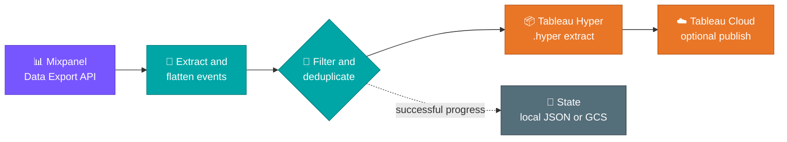
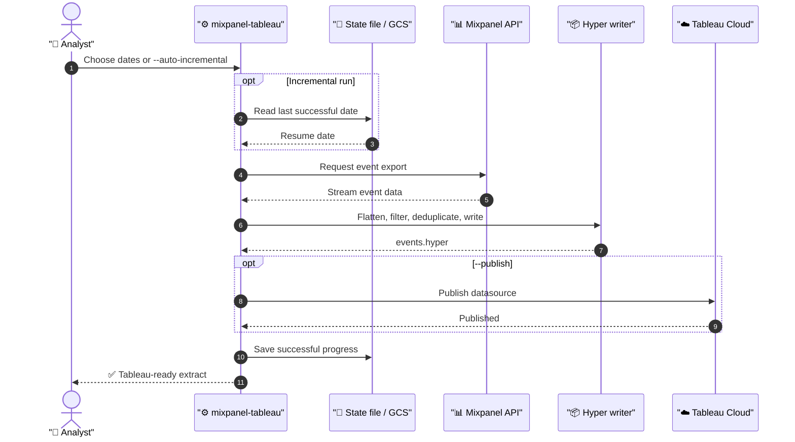

# Mixpanel → Tableau Hyper Pipeline 🚀

[](https://github.com/kimchyoungman/mixpanel-tableau-pipeline/actions/workflows/ci.yml)
[](https://www.python.org/downloads/)
[](LICENSE)

> **Turn raw Mixpanel events into Tableau-ready data—automatically.** ✨

Export Mixpanel product analytics data, flatten event properties, and generate a
Tableau Hyper extract (`.hyper`) in one repeatable pipeline. Run it locally,
schedule it with GitHub Actions or Cloud Run, and optionally publish directly
to Tableau Cloud. 🎉

**Built for** analytics engineers, data teams, and Tableau users who want a
reliable Mixpanel-to-Tableau ETL workflow without maintaining custom export
scripts.

| Start here | What you get | Run it where you work |
| --- | --- | --- |
| [Quick start](#quick-start) ⚡ | Flattened, Tableau-ready events | Local · Docker · GitHub Actions · Cloud Run |

## The pipeline at a glance



### What happens on every run

1. **Fetch** events from the Mixpanel Data Export API for the requested dates.
2. **Shape** them into Tableau-friendly columns by flattening top-level event properties.
3. **Control quality** with event filters, property filters, `$insert_id` deduplication, and chunked processing.
4. **Deliver** a `.hyper` extract, optionally publish it to Tableau Cloud, and save progress for the next run. 🚀

## Why this pipeline?

- **Tableau-native output** — creates a `.hyper` extract, not an intermediate CSV you still need to manage.
- **Incremental by design** — resumes after the last successful date from local JSON or Google Cloud Storage state.
- **Production-minded controls** — chunk large ranges, validate configuration before requests, and stop on state failures.
- **Flexible delivery** — use the CLI locally, containerize it with Docker, or automate it in GitHub Actions and Cloud Run.

> [!TIP]
> Start with a one-day export to confirm the event schema, then move to
> `--auto-incremental` for recurring refreshes. Small first run, fewer surprises. ✨

## Quick start

Clone the repository and install the local Hyper generation dependencies:

```bash
git clone https://github.com/kimchyoungman/mixpanel-tableau-pipeline.git
cd mixpanel-tableau-pipeline

python -m venv .venv
source .venv/bin/activate
python -m pip install --upgrade pip
pip install .
```

Create a local configuration file:

```bash
cp .env.example .env
```

Set the required values in `.env`:

```ini
MIXPANEL_API_SECRET=your_mixpanel_api_secret
MIXPANEL_PROJECT_ID=your_mixpanel_project_id
MIXPANEL_TIMEZONE=UTC
```

Validate configuration without calling an external API, then export a date range:

```bash
mixpanel-tableau --check-config

mixpanel-tableau \
  --from-date 2026-01-01 \
  --to-date 2026-01-31
```

🎊 Your extract is written to `./output` unless you set `--output` or `OUTPUT_DIR`.

## Your first export: user flow



## Installation options

| Use case | Installation command |
| --- | --- |
| Local Hyper generation | `pip install .` |
| Tableau Cloud publishing | `pip install ".[tableau]"` |
| GCS-backed state | `pip install ".[gcs]"` |
| Tableau and GCS | `pip install ".[tableau,gcs]"` |
| Contributor environment | `uv sync --all-extras --frozen --no-editable` |

The committed `uv.lock` provides a reproducible contributor and CI dependency
set. `requirements.txt` remains available for conventional deployment systems.

## Common workflows

### Export yesterday

```bash
mixpanel-tableau --yesterday
```

`--yesterday` uses `MIXPANEL_TIMEZONE`, so set it to the timezone your team
uses for reporting.

### Export only selected events and properties

```bash
mixpanel-tableau \
  --from-date 2026-01-01 \
  --to-date 2026-01-31 \
  --events "Page View" "Button Click" \
  --columns mp_os mp_browser plan
```

Mixpanel property names are normalized to lowercase. A leading `$` becomes
`mp_`, while spaces, hyphens, and periods become underscores. For example,
`$browser` becomes `mp_browser`. Nested dictionaries and lists are stored as
JSON text rather than expanded into additional columns.

To keep a reusable property list, pass `--column-file columns.txt` with one
property name per line.

### Filter events

Filters use flattened property names and an exact `key=value` comparison.
Multiple filters are combined with AND logic.

```bash
mixpanel-tableau \
  --from-date 2026-01-01 \
  --to-date 2026-01-31 \
  --filter "mp_country_code=US" \
  --filter "plan=pro"
```

### Process a large range in chunks

```bash
mixpanel-tableau \
  --from-date 2025-01-01 \
  --to-date 2025-12-31 \
  --chunked \
  --chunk-days 7
```

Use `--chunk-months 1` instead when monthly chunks are more appropriate.

### Run incrementally

```bash
mixpanel-tableau --auto-incremental
```

The first incremental run defaults to yesterday. Later runs start on the day
after the last successfully recorded date. To store state in GCS:

```ini
STATE_PATH=gs://your-bucket/mixpanel-tableau/state.json
```

The runtime identity must have read and write access to that object. GCS state
load or save failures stop the pipeline rather than silently restarting progress.

### Publish to Tableau Cloud

```bash
mixpanel-tableau \
  --from-date 2026-01-01 \
  --to-date 2026-01-31 \
  --publish \
  --project-name Analytics \
  --datasource-name mixpanel_events \
  --tableau-overwrite
```

Publishing uses append mode by default. Add `--tableau-overwrite` to replace
the existing datasource.

## Configuration

Configuration is loaded from environment variables and an optional `.env` file
in the directory where the command is run.

### Mixpanel

| Variable | Required | Default | Description |
| --- | --- | --- | --- |
| `MIXPANEL_API_SECRET` | Yes | — | Mixpanel Data Export API secret |
| `MIXPANEL_PROJECT_ID` | Yes | — | Mixpanel project ID |
| `MIXPANEL_TIMEZONE` | No | `UTC` | Timezone used for timestamps and `--yesterday` |

### Local output and state

| Variable | Required | Default | Description |
| --- | --- | --- | --- |
| `OUTPUT_DIR` | No | `./output` | Directory for generated Hyper files |
| `LOG_DIR` | No | `./logs` | Directory for pipeline logs |
| `STATE_PATH` | No | `./state.json` | Local state file or `gs://bucket/path/state.json` |

Relative paths are resolved from the directory where the CLI is run.

### Tableau Cloud

These values are required only with `--publish`.

| Variable | Required for publishing | Default | Description |
| --- | --- | --- | --- |
| `TABLEAU_SERVER_URL` | Yes | — | Tableau Cloud pod URL |
| `TABLEAU_SITE_ID` | Yes | — | Tableau site content URL / site ID |
| `TABLEAU_TOKEN_NAME` | Yes | — | Personal access token name |
| `TABLEAU_TOKEN_VALUE` | Yes | — | Personal access token secret |
| `TABLEAU_PROJECT_NAME` | No | `Default` | Target Tableau project |
| `TABLEAU_DATASOURCE_NAME` | No | `mixpanel_hyper` | Published datasource name |

Validate Mixpanel and Tableau settings together:

```bash
mixpanel-tableau --check-config --publish
```

## CLI reference

| Option | Description |
| --- | --- |
| `--from-date YYYY-MM-DD` | First export date; requires `--to-date` |
| `--to-date YYYY-MM-DD` | Last export date |
| `--yesterday` | Export yesterday in `MIXPANEL_TIMEZONE` |
| `--auto-incremental` | Continue from the saved state through yesterday |
| `--check-config` | Validate configuration without exporting |
| `--output`, `-o` | Output Hyper file path |
| `--events`, `-e` | Event names to export |
| `--columns`, `-c` | Event properties to include |
| `--column-file` | File containing one property name per line |
| `--filter`, `-f` | Exact property filter in `key=value` form; repeatable |
| `--chunked` | Enable chunked processing |
| `--chunk-days` | Number of days per chunk |
| `--chunk-months` | Number of months per chunk |
| `--publish` | Publish the generated extract to Tableau Cloud |
| `--project-name` | Override the target Tableau project |
| `--datasource-name` | Override the Tableau datasource name |
| `--tableau-overwrite` | Replace instead of append during publishing |
| `--verbose`, `-v` | Enable verbose console logging |

Run `mixpanel-tableau --help` for the authoritative option list.

## Automation

### GitHub Actions

The included `daily_etl.yml` workflow is manual by default so a public fork
cannot start exporting data unexpectedly.

Configure these repository secrets:

- `MIXPANEL_API_SECRET`
- `MIXPANEL_PROJECT_ID`
- `TABLEAU_SERVER_URL`, `TABLEAU_SITE_ID`, `TABLEAU_TOKEN_NAME`, and
  `TABLEAU_TOKEN_VALUE` when publishing

Optional repository variables:

- `MIXPANEL_TIMEZONE`
- `TABLEAU_PROJECT_NAME`
- `TABLEAU_DATASOURCE_NAME`
- `PUBLISH_TO_TABLEAU=true` for scheduled publishing

When publishing is disabled, the workflow stores `events.hyper` as a GitHub
Actions artifact for seven days. To run on a schedule, add a `schedule` trigger
only after configuring secrets for that repository.

### Docker

Local secrets and generated data are excluded from the Docker build context.
The container runs as a non-root user.

```bash
docker build -t mixpanel-tableau-pipeline .
docker run --rm \
  --env-file .env \
  -v "$PWD/output:/app/output" \
  mixpanel-tableau-pipeline --yesterday
```

### Google Cloud

`cloudbuild.yaml` builds the image into Artifact Registry. Create the configured
repository before the first build and store runtime credentials in Secret
Manager rather than in the image or build configuration.

See [DEPLOYMENT.md](DEPLOYMENT.md) for GitHub Actions, Artifact Registry, runtime
configuration, and local scheduler guidance.

## Frequently asked questions

### How do I export Mixpanel data to Tableau?

Configure your Mixpanel credentials, run `mixpanel-tableau` for a date range,
and open the generated `.hyper` extract in Tableau. This repository automates
the extraction, transformation, and Hyper file generation steps.

### Can this pipeline publish a Mixpanel extract to Tableau Cloud?

Yes. Install the Tableau extra, configure a Tableau Cloud personal access token,
then include `--publish`. The pipeline appends by default and can replace a
datasource with `--tableau-overwrite`.

### Can I schedule incremental Mixpanel-to-Tableau syncs?

Yes. Use `--auto-incremental` with a local state file or a GCS-backed
`STATE_PATH`, then schedule the command with GitHub Actions, Cloud Run, or your
own scheduler.

### Does it handle empty exports and duplicate events?

Yes. It creates a valid empty Hyper extract for empty result sets and uses
Mixpanel's `$insert_id` for deduplication when that identifier is available.

## Project structure

```text
mixpanel-tableau-pipeline/
├── .github/
│   ├── ISSUE_TEMPLATE/
│   └── workflows/
│       ├── ci.yml
│       └── daily_etl.yml
├── config/
│   └── settings.py
├── src/
│   ├── data_transformer.py
│   ├── hyper_writer.py
│   ├── mixpanel_client.py
│   ├── pipeline.py
│   ├── state_manager.py
│   └── tableau_publisher.py
├── tests/
├── Dockerfile
├── cloudbuild.yaml
├── main.py
├── pyproject.toml
└── uv.lock
```

## Development

Create the locked contributor environment and run the same checks used by CI:

```bash
uv sync --all-extras --frozen --no-editable
.venv/bin/ruff check .
.venv/bin/pytest --cov=src --cov=config --cov-report=term-missing
```

CI runs linting, tests, and CLI smoke checks on Python 3.11 and 3.12. See
[CONTRIBUTING.md](CONTRIBUTING.md) before opening a pull request.

## Security

> [!IMPORTANT]
> Mixpanel exports can contain user identifiers, URLs, campaign parameters, and
> other personal or commercially sensitive data. Never commit credentials,
> logs, state files, event payloads, or generated Hyper extracts. 🔒

Report vulnerabilities privately through the repository's **Security** tab.
See [SECURITY.md](SECURITY.md) for the full policy.

## Contributing

Issues and pull requests are welcome. Keep examples account-agnostic, add tests
for behavior changes, and never use production credentials or real event data
in fixtures. See [CONTRIBUTING.md](CONTRIBUTING.md) and
[CODE_OF_CONDUCT.md](CODE_OF_CONDUCT.md).

## License

Released under the [MIT License](LICENSE). 🎊
